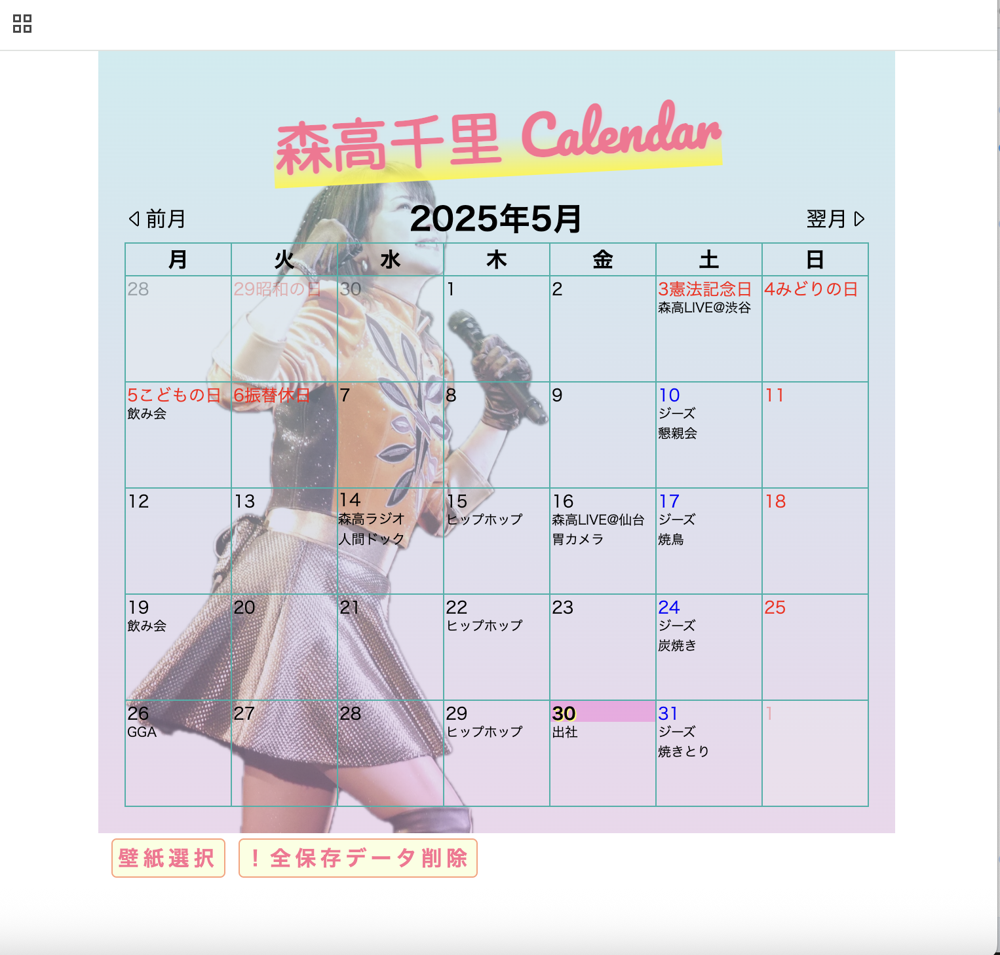

## 制作アプリのタイトル
  森高千里カレンダー

## 制作アプリの説明（40文字程度）
  スケジュールを書き込めるスケジュールカレンダーアプリ。

## 工夫した点・こだわった点
- ローカルストレージを使う部分は、入力したイベント（予定）と、選択した壁紙。
- 任意の日にちをクリックするとイベント入力画面が表示され、イベントを入力できる。
入力したイベントは、タイトルがカレンダーに表示される。登録済みイベントの編集、削除も可能。
- 入力したイベントは、ストレージに保存され、リロードした際は元の日付の場所に再表示される。
- 壁紙は、選択画面から変更が可能。選択した壁紙はストレージの保存され、リロード時も読み込まれる。
- 祝日の表示（赤色＆名称）。当初、jsに祝日を書き込み、判定して祝日表示を想定していたが、祝日は毎年微妙に変わるので、翌年になるとまた祝日を調べて書き直す必要がある。どこかから引っ張ってこれるのではないかと思っていたところ、「お天気アプリWEB API活用」の文字が目に止まり、もしかしたら・・・で調べたところ、祝日APIをみつけ、試しにAPI連携してデータを取得する方法でやってみたらできた（今年と来年の祝日）。
- 日曜から土曜は数字の0〜6で表される。あえて月曜始まりのカレンダーにアレンジし、少し手間が増えた。
- （おまけ）4月11日に森高さんの誕生日を表示！

## 次回トライしたこと（または機能）
- 今回、複数日にまたがるイベントや、イベントの繰り返し登録までは実装していない。さらに機能を加えるとすれば、そのあたり。

## 備考（感想、シェアしたいこと等なんでも）
- 今回の学び
  - 日付に関するメソッドを覚えた。
  - “this”の使い方が初めてわかってきた。
  - forEachがそこそこ使えるようになってきた。
- 世の中、カレンダーアプリは山ほど中で、オンリーワンな機能は、なかなか思いつかなかった。

## Top Page Capture
